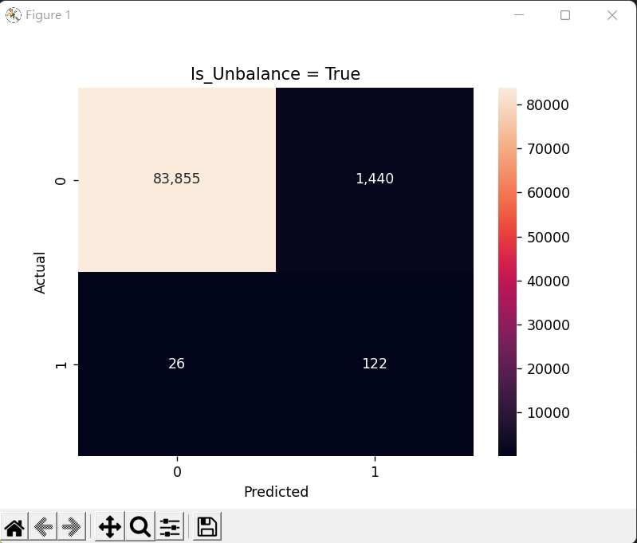
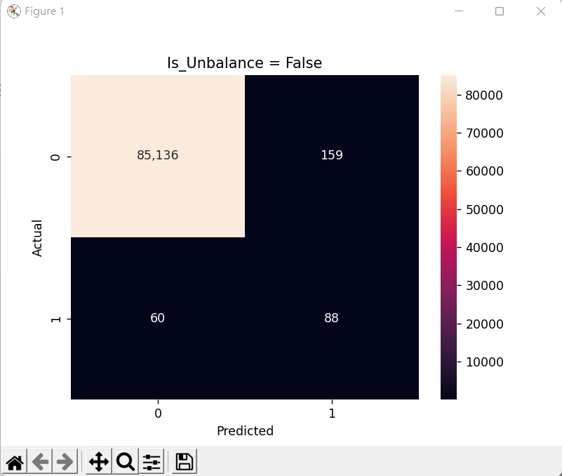

## LightGBM
Gradient Boosting Machine, GBM 又稱輕量化(Light)的梯度提升機(GBM) 
主要採用 leaf-wise tree 演算法，因此在迭代過程中能更快收斂，但也容易 overfiting 
目的為:
- 以決策樹為基底的 model ，不斷迭代訓練並取得較佳的 model。
- 演算法進行優化，是訓練速度變快，並且有效減少被消耗的資源。

優點(與 XGBoost 比較):
- 更快的訓練速度以及較高效率
- 較低的記憶體使用率
- 支援 GPU 平行運算
- 能夠處理大規模數據

**處理 unbalance 資料** 
作為分類器時，可以使用 `is_unbalance = True` 抑或 `scale_pos_weight` 擇一使用。 

**Stratify** 為分層隨機抽樣: 
split 裡面的參數，如範例程式中， `stratify = y` 
依照 y 的比例分配，為了保持與 split 前相同的分布。

---
LightGBM run 兩種 model，主要觀察 is_unbalance 的差異， 
並且使用混淆矩陣來做近一步的分析

is_unbalance 設為 False 雖然誤判的數量少於設為 True ，但是 148 筆盜刷資料僅有 88 筆被成功辨識出來。 
猜測模型在大多數狀況都會預測資料未被盜刷的機率較大，如圖所示 

