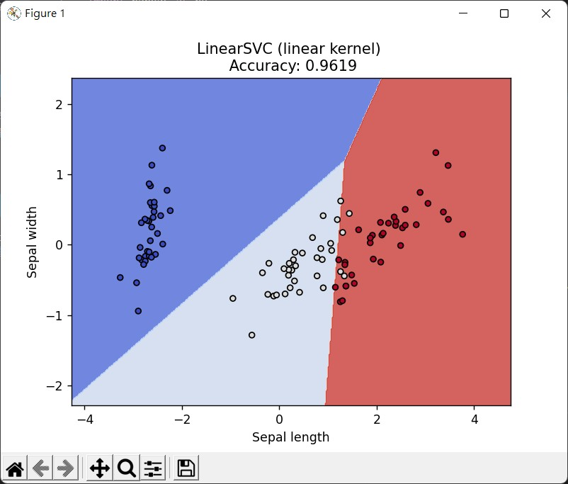

## SVM(support vector machine, SVM)支持向量機
屬於統計學習的監督式演算法
利用不同資料類別當中的分隔線，將問題分類，而 SVM 於多種可能當中選出最佳之分隔線
分隔線會有正負兩條虛線，與虛線最近的點稱為支持向量(support vector)。
SVM除了線性也有非線性，使用核函數進行高維度的分類或降維，
兩個非線性的Kernel:
- Polynomial 高次方轉換
- Radial Basis Function 高斯轉換

#####SVR(Support Vector Regression, SVR)支持向量回歸
由SVM衍伸出來的，SVM 處理分類性質，SVR 則處理回歸性質。
SVR只要 $$f(x)$$與$$y$$偏離程度在接受範圍則可認為預測成功。

---
當中建立模型有個特別的參數，
如 `svc = svm.LinearSVC(C = 1, max_iter = 1000)`。
裡頭的 C 參數代表懲罰係數，針對訓練錯的樣本進行懲罰，
C 越大，訓練過程中準確率越大，但泛化能力會降低，
反之，C 越小，訓練過程容忍程度很大，泛化能力會有所提升。
舉例， 今天訓練猛男的資料，C 設定越大，原本訓練資料的猛男都只有六塊肌，
突然拿出八塊肌的猛男，則被判斷不是猛男；
反之，C 設定越小，可能連骨瘦如材的人也被容忍為猛男。
因此 C 在設定上需要去調整與拿捏。

