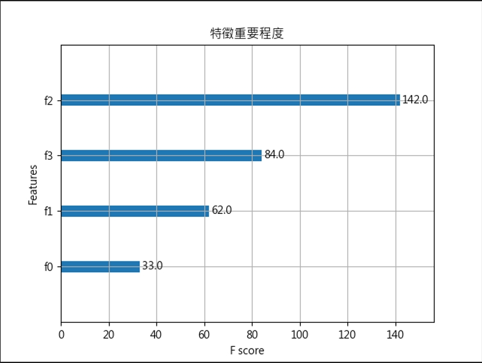

## XGBoost
全名為 eXtreme Gradient Boosting,
目前是 Kaggle 競賽中最常見的演算法, (Kaggle 是數據建模與分析的競賽平台)
以 Gradient Boosting 為基礎, 結合了 Bagging & Boosting 的優點,
透過 Boosting 的技巧,將**弱的決策樹合在一起成一個強的模型**。
目標:新生成的樹能改善前面樹的的錯誤，並採用特徵隨機抓取，與隨機森林相仿。

為了使模型更加複雜，
XGBoost 在目標函數添加了標準化
模型在訓練時為了擬合訓練資料
會產生很高次項的函數,
但反而容易造成受雜訊干擾，導致過度擬合
因此 L1/L2 Regularization 目的讓損失函數更加平滑,
且抗雜訊干擾能力更強,
最後用到 Gradient 一階導數以及 Hessian 二階導數來生成下一棵樹。

### XGBoost 優點
1. 利用二階梯度對節點進行劃分
2. 利用局部近似演算法對分裂節點進行優化
3. 在損失函數中加入 L1/L2 項,控制模型的複雜度
4. 提供 GPU 平行化運算

